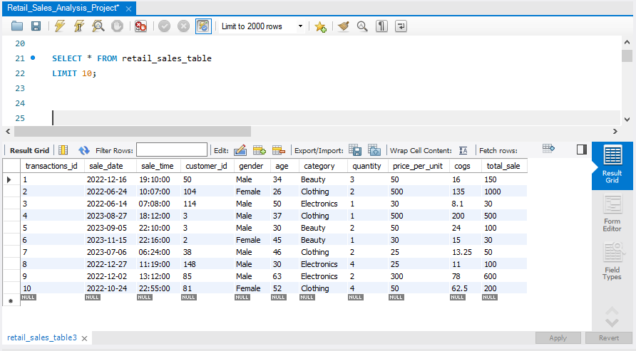
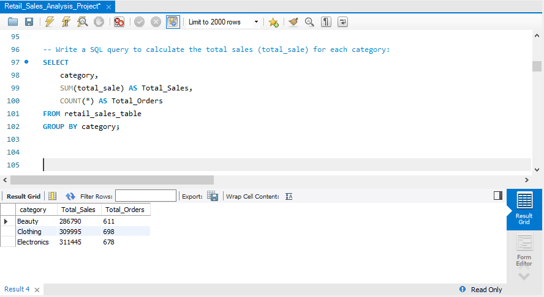
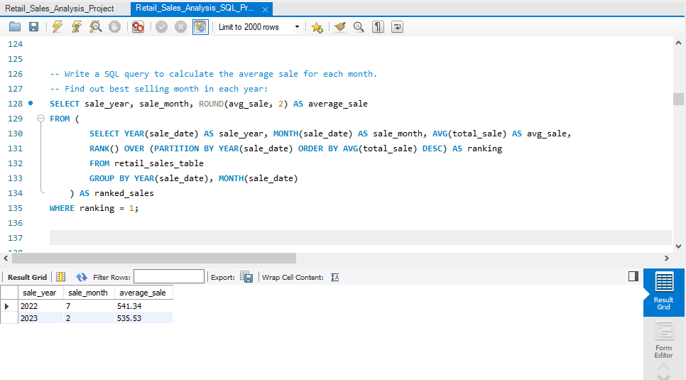
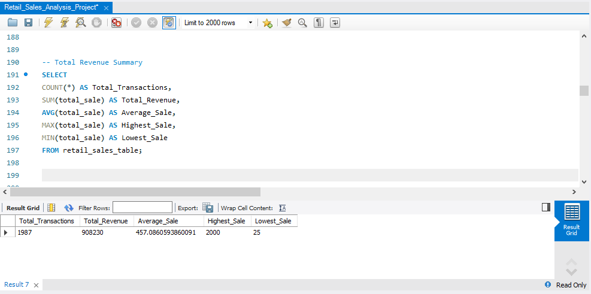
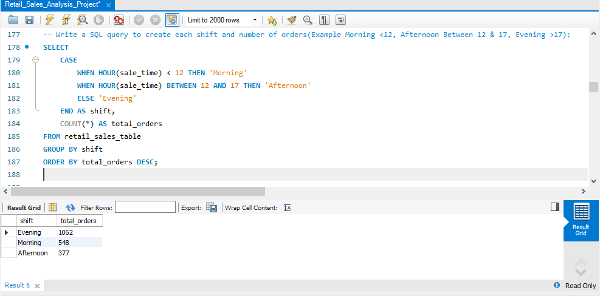

# 🛍️ Retail Sales SQL Analysis

## 📌 Project Overview

This project analyzes retail sales data using **MySQL** to uncover business insights and demonstrate practical SQL skills. It covers data exploration, sales analysis, customer behavior, and business reporting using SQL queries.

This project is designed as part of my Data Analytics portfolio to showcase SQL proficiency through real-world business scenarios.

---

## 🎯 Objectives

- Analyze retail sales data using SQL
- Generate business insights from sales transactions
- Practice SQL concepts using a real-world dataset
- Build a portfolio-ready SQL project

---

## 🛠️ Tools & Technologies

- **Database:** MySQL
- **IDE:** MySQL Workbench
- **Language:** SQL
- **Dataset Format:** CSV
- **Version Control:** Git & GitHub

---

## 📂 Dataset

The dataset contains retail sales transaction records with the following fields:

- Transaction ID
- Sale Date
- Sale Time
- Customer ID
- Gender
- Age
- Product Category
- Quantity
- Price per Unit
- Cost of Goods Sold (COGS)
- Total Sale

---

## 🗄️ Database Schema

The project uses a single table:

**retail_sales_table**

### Table Structure


### Database Schema


---

## 📊 SQL Concepts Used

This project demonstrates:

- CREATE DATABASE
- CREATE TABLE
- SELECT Statements
- WHERE Clause
- ORDER BY
- GROUP BY
- Aggregate Functions
- CASE Statements
- Date Functions
- Time Functions
- LIMIT
- Business Analytics Queries

---

## 📈 Business Questions Solved

✔️ Total number of sales

✔️ Number of unique customers

✔️ Category-wise sales analysis

✔️ Total sales and total orders by category

✔️ Best selling month

✔️ Sales by customer age and gender

✔️ Sales during Morning, Afternoon and Evening shifts

✔️ Overall sales summary

---

## 📸 Project Screenshots

### Dataset Preview



### Create Table


### Category Sales Analysis



### Best Selling Month



### Sales Summary



### Shift Analysis



---

## 💡 Key Insights

- Electronics generated the highest overall sales.
- Clothing recorded the highest number of customer orders.
- Evening shift had the maximum number of transactions.
- Customer purchasing behavior varies across product categories.
- SQL can effectively transform raw transactional data into meaningful business insights.

---

## 📁 Project Structure

```
Retail-Sales-SQL-Analysis/
│
├── README.md
├── Retail_Sales_Analysis_Project.sql
├── retail_sales.csv
├── LICENSE
└── Images/
    ├── create_table.png
    ├── database_schema.png
    ├── dataset_preview.png
    ├── table_structure.png
    ├── category_sales_analysis.png
    ├── best_selling_month_analysis.png
    ├── sales_summary.png
    └── shift_analysis.png
```

---

## 🚀 How to Run the Project

1. Download or clone this repository.
2. Open **MySQL Workbench**.
3. Create a new database.
4. Import the `retail_sales.csv` dataset.
5. Execute `Retail_Sales_Analysis_Project.sql`.
6. Run the queries to reproduce the analysis.

---

## 🎓 Skills Demonstrated

- SQL Programming
- Data Exploration
- Data Analysis
- Business Intelligence
- Aggregate Functions
- Conditional Logic
- Database Design
- Data Reporting

---

## 👩‍💻 Author

**Aysha Rafiya**

- GitHub: https://github.com/aysharafiya11

---

## ⭐ If you found this project useful, consider giving it a star!
