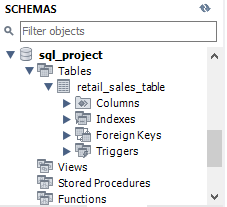
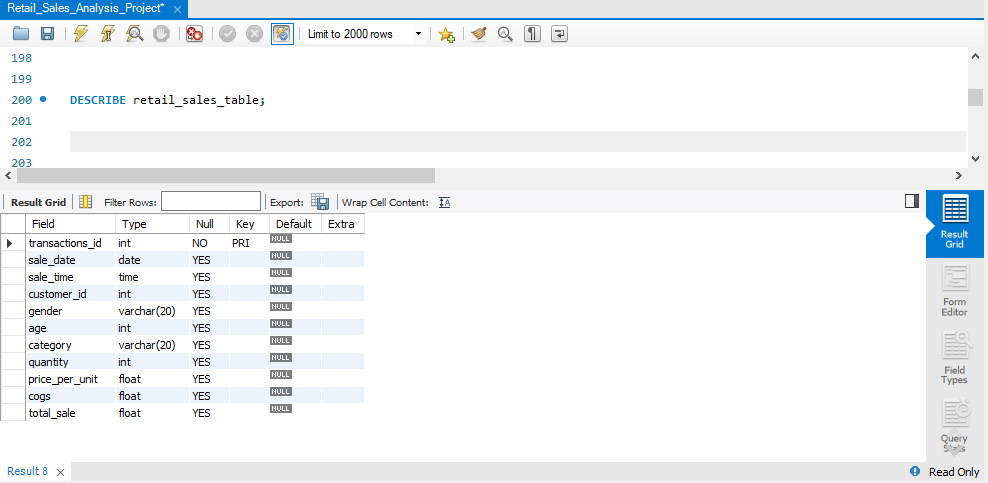
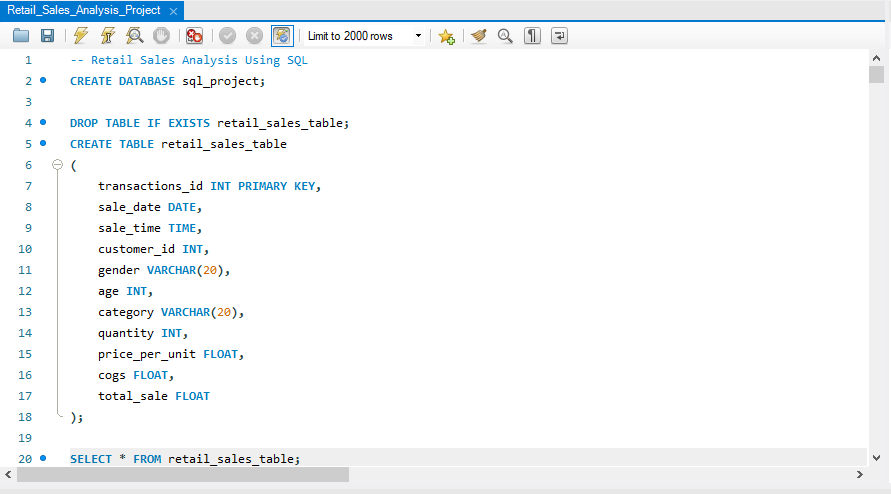

# 🛍️ Retail Sales Analysis using MySQL


## 📖 Project Overview

This project demonstrates end-to-end SQL analysis using **MySQL
Workbench** on a retail sales dataset. It covers database creation, data
import, data cleaning, exploratory data analysis (EDA), business
reporting, and advanced SQL analytics using Common Table Expressions
(CTEs) and Window Functions.

More than **35 business questions** were solved to uncover customer
behavior, sales trends, product performance, and revenue insights.

## 🎯 Objectives

-   Build a retail sales database in MySQL.
-   Import and validate transaction data.
-   Clean and inspect the dataset.
-   Perform exploratory data analysis.
-   Answer business questions using SQL.
-   Demonstrate advanced SQL techniques.
-   Build a portfolio-ready SQL project.

## 🛠️ Tech Stack

 | Tool         | Purpose |
 | ---------------| ------------|
 | MySQL         |    Database |
 | MySQL Workbench  | SQL IDE|
 | SQL             |  Query Language|
 | Git             |  Version Control|
 | GitHub           | Portfolio Hosting|

## 📂 Dataset Information

The dataset contains retail transactions with the following fields:

-   Transaction ID
-   Sale Date
-   Sale Time
-   Customer ID
-   Gender
-   Age
-   Category
-   Quantity
-   Price per Unit
-   COGS
-   Total Sale

## 📥 Dataset Import

The original CSV contained **2,000** records.

While importing using **MySQL Workbench -- Table Data Import Wizard**,
only **1,987** records were imported successfully.

 | Description            |   Records|
 | -----------------------|--------- |
 | Original Dataset       |   2,000  | 
 | Successfully Imported  |  1,987   |
 | Not Imported           |    13    | 

> The excluded records contained incomplete values (primarily in the **Age** and
> **Quantity** column). Rather than manually modifying the source data,
> the analysis was performed on the 1,987 successfully imported records.

## 🗄️ Database Setup

``` sql
CREATE DATABASE SQL_Project;

CREATE TABLE retail_sales_table(
 transactions_id INT PRIMARY KEY,
 sale_date DATE,
 sale_time TIME,
 customer_id INT,
 gender VARCHAR(20),
 age INT,
 category VARCHAR(20),
 quantity INT,
 price_per_unit FLOAT,
 cogs FLOAT,
 total_sale FLOAT
);
```

### Screenshots

- **Database Schema:**



- **Table Structure:**



- **Create Table:**



## 🧹 Data Cleaning

### Check for Missing Values

``` sql
SELECT *
FROM retail_sales_table
WHERE sale_date IS NULL
OR sale_time IS NULL
OR customer_id IS NULL
OR gender IS NULL
OR age IS NULL
OR category IS NULL
OR quantity IS NULL
OR price_per_unit IS NULL
OR cogs IS NULL
OR total_sale IS NULL;
```

### Record Count

``` sql
SELECT COUNT(*) FROM retail_sales_table;
```

### Unique Customers

``` sql
SELECT COUNT(DISTINCT customer_id)
FROM retail_sales_table;
```

### Product Categories

``` sql
SELECT DISTINCT category
FROM retail_sales_table;
```

### Dataset Preview

``` sql
SELECT *
FROM retail_sales_table
LIMIT 10;
```

## 🔍 Exploratory Data Analysis

The project validates: 
- Dataset completeness
- Product categories
- Customer distribution
- Sales records
- Transaction volume

## 📊 Business Analysis

### Sales Analysis

-   Sales on a specific date
-   Clothing sales in November 2022
-   Category-wise revenue
-   Total orders by category
-   Highest revenue category
-   Monthly revenue trend
-   Best selling month
-   Revenue contribution by category

### Customer Analysis

-   Top 10 customers
-   Repeat customers
-   Customers spending above average
-   Average age by category
-   Gender-wise spending
-   Unique customers by category

### Time-Based Analysis

-   Revenue by weekday
-   Revenue by hour
-   Peak shopping hours
-   Morning / Afternoon / Evening shift analysis

### Product Analysis

-   Highest-selling category each month
-   Average quantity purchased
-   Revenue by age group

### Advanced SQL Analytics

-   Top 3 customers per category (DENSE_RANK)
-   Running total of daily sales
-   7-day moving average
-   Month-over-Month growth (LAG)
-   Daily sales above monthly average
-   Median transaction value (ROW_NUMBER)
-   Category ranking within each gender

## 🚀 SQL Concepts Demonstrated

-   CREATE DATABASE / CREATE TABLE
-   SELECT, WHERE, ORDER BY, LIMIT
-   GROUP BY, HAVING
-   Aggregate Functions
-   CASE Expressions
-   Date & Time Functions
-   CTEs
-   Window Functions
-   RANK(), DENSE_RANK(), ROW_NUMBER(), LAG()
-   SUM() OVER(), AVG() OVER()

## 💡 Key Insights

-   Electronics generated the highest revenue.
-   Clothing recorded the highest number of orders.
-   Evening was the busiest shopping period.
-   Revenue varies significantly across product categories.
-   Window functions simplify ranking and trend analysis.

## 📁 Project Structure

``` text
Retail-Sales-SQL-Analysis/
├── README.md
├── LICENSE
├── Retail_Sales_Analysis_Project.sql
├── retail_sales.csv
└── Images/
    ├── create_table.png
    ├── database_schema.png
    ├── table_structure.png
    ├── dataset_preview.png
    └── sales_summary.png
```

## ▶️ How to Run

1.  Clone the repository.
2.  Open MySQL Workbench.
3.  Create the database.
4.  Import `retail_sales.csv`.
5.  Execute `Retail_Sales_Analysis_Project.sql`.
6.  Run the queries to reproduce the analysis.

## 🎓 Skills Demonstrated

-   SQL Programming
-   Data Cleaning
-   Exploratory Data Analysis
-   Business Analytics
-   Customer Analytics
-   Sales Analytics
-   CTEs
-   Window Functions
-   Ranking Functions
-   Time-Series Analysis

## 👩‍💻 Author

**Aysha Rafiya**

------------------------------------------------------------------------

⭐ If you found this project useful, consider giving it a star!
